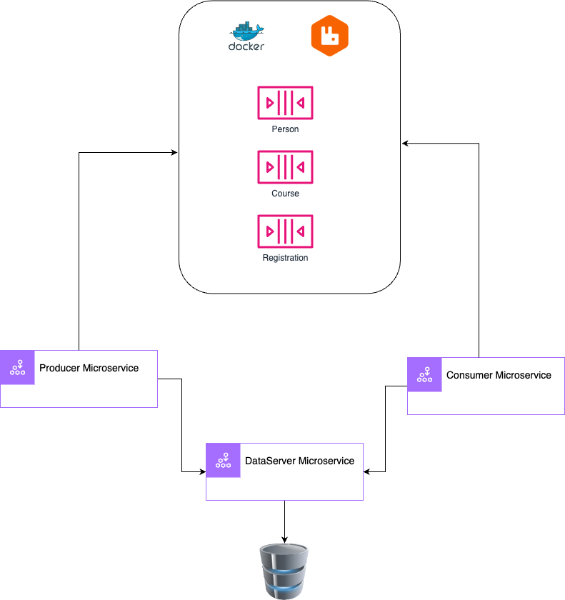

# Demo RabbitMQ with Spring Boot

This project aims to build a Java application model in modules.


## :: Resources ::

* OpenJDK 17
* Spring Boot 3.4.2
* Spring Doc 2.8.1
* Spring Cloud 2024.0.0 (feignClient)
* Lombok 1.18.32
* H2 Database
* RabbitMQ 3.13.7

## :: Architecture ::

The architecture was developed in microservices using modular development, optimizing resources and providing better maintainability.


## :: Modules ::

### Core
- Module responsible for classes/business models and tools
### DataServer
- Module responsible for data persistence
### ApiClient
- Module responsible for redirecting requests
### Consumer
- Queue consumer module
### Producer
- Queue producer module


## Command to Run

### :: Docker ::

```bash
  docker-compose -f rabbitmq-docker-compose.yml up
```

### :: Microservices ::

```bash
  cd <path>/dataserver
  mvn spring-boot:run
```

```bash
  cd <path>/producer
  mvn spring-boot:run
```

```bash
  cd <path>/consumer
  mvn spring-boot:run
```

## Monitoring

### H2 Database
* User: sa
* Password: 123456
* path: jdbc:h2:file:./data/dataDb

<a href="http://localhost:8080/h2-console#/" target="_blank">H2 Console</a>

### DataServer Documentation
<a href="http://localhost:8080/dataServer.html#/" target="_blank">Swagger DataServer</a>

### Consumer Documentation
<a href="http://localhost:8282/consumer.html#/" target="_blank">Swagger DataServer</a>

### Producer Documentation
<a href="http://localhost:8383/producer.html#/" target="_blank">Swagger DataServer</a>

### RabbitMQ
<a href="http://localhost:15672#/" target="_blank">RabbitMQ</a>


## Authors

- [Carlos Alves](https://github.com/casdeveloper)

  +55 (16) 99173 - 1314

  casdeveloepr@icloud.com